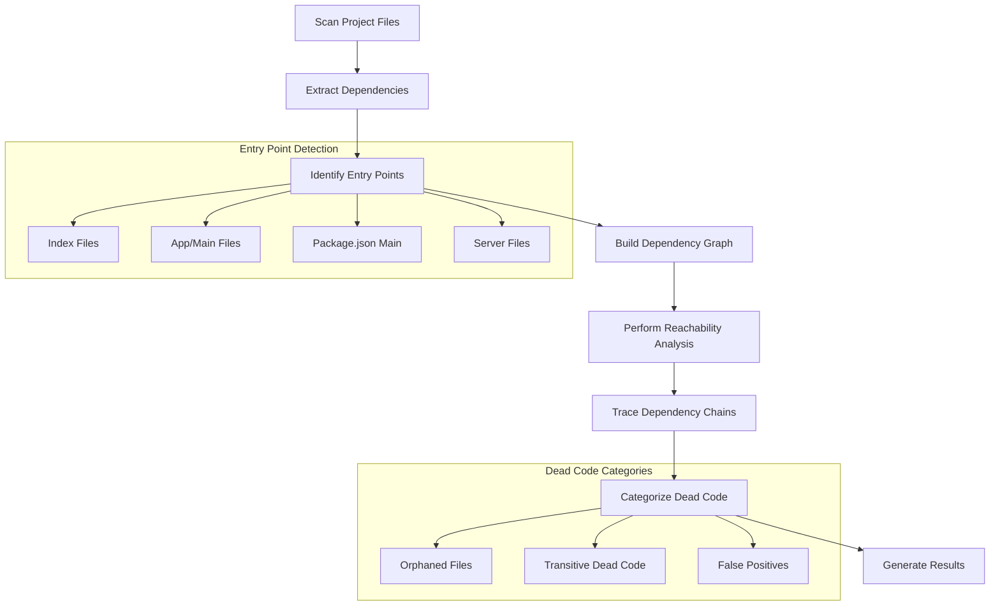
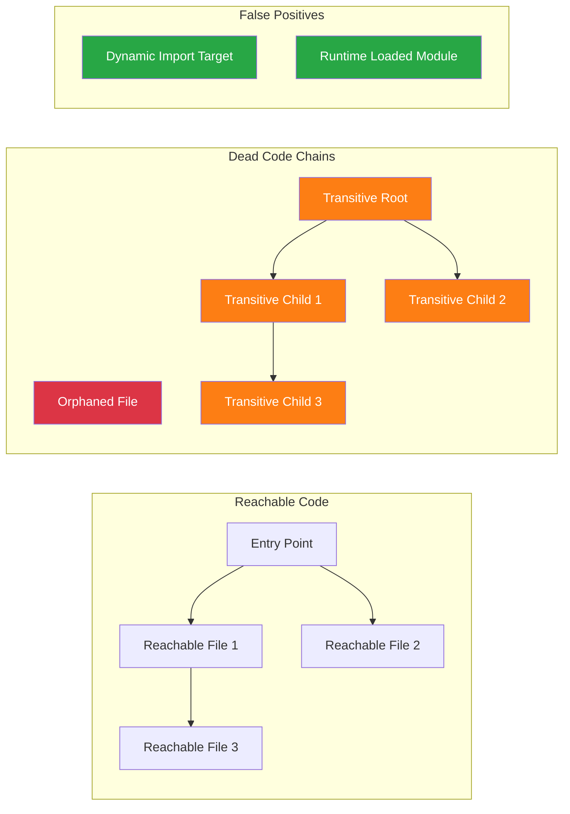
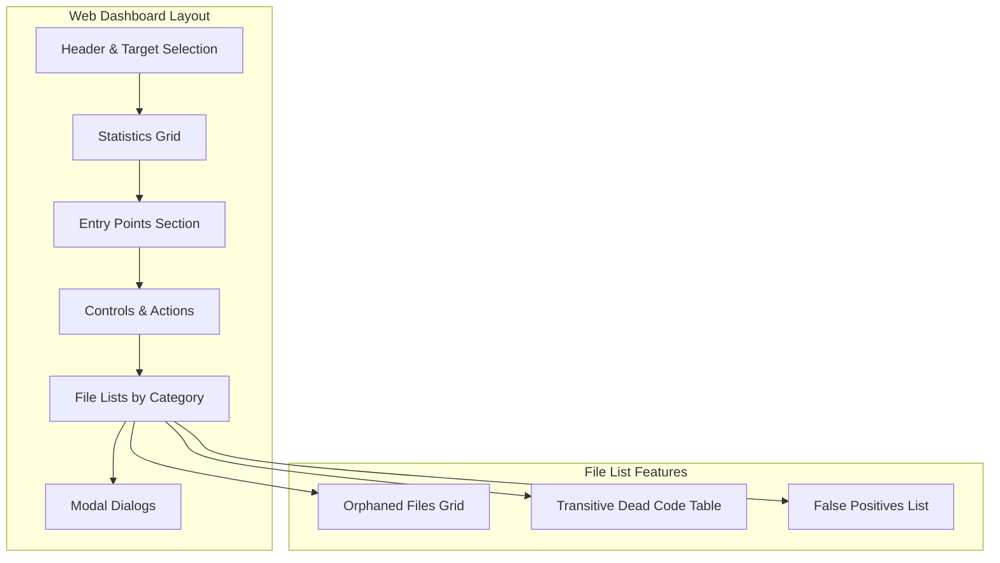

# 🔗 Dead Code Analyzer

A sophisticated hierarchical dead code analysis tool for JavaScript/TypeScript projects that identifies and categorizes unused code through dependency chain analysis.

## 🎯 Overview

This analyzer goes beyond simple static analysis by building a complete dependency graph of your codebase and tracing hierarchical chains from entry points to identify truly unreachable code. It distinguishes between different types of dead code and provides an interactive web interface for visualization and cleanup.

## ✨ Key Features

- **Hierarchical Chain Analysis**: Traces dependency paths from entry points to identify dead code chains
- **Smart Categorization**: Distinguishes between orphaned files, transitive dead code, and false positives
- **Interactive Web Dashboard**: Modern UI with real-time updates and bulk operations
- **Barrel Export Support**: Handles index.js re-exports and complex module patterns
- **Safe Deletion**: Preview and batch delete files with dependency impact analysis
- **Real-time Updates**: Auto-refresh after deletions to show cascading effects

## 🔍 How It Works

The analyzer performs a multi-step process to identify dead code:



### Analysis Steps

1. **File Discovery**: Scans for `.js`, `.jsx`, `.ts`, `.tsx` files while excluding test files and build artifacts
2. **Dependency Extraction**: Parses import/require statements and handles barrel exports
3. **Entry Point Identification**: Finds application entry points (index, App, main, server files)
4. **Reachability Analysis**: Uses BFS traversal from entry points to mark reachable files
5. **Chain Analysis**: Traces dependency chains for unreachable files to classify them

## 📊 Dead Code Categories

### 🗑️ Orphaned Files
Files that are not imported by any other file in the codebase.
- **Safety**: Highest - safest to delete
- **Impact**: None - no other files depend on them

### 🔗 Transitive Dead Code
Files that are only used by other dead code, creating unreachable chains.
- **Safety**: High - safe to delete entire chains
- **Impact**: Cascading - deleting these may make other files orphaned

### ❌ False Positives
Files incorrectly marked as dead due to:
- Dynamic imports that can't be statically analyzed
- Runtime module loading
- External references not detectable by static analysis



## 🚀 Quick Start

### Prerequisites
- Node.js 14.0.0 or higher
- JavaScript/TypeScript project

### Installation

1. Clone the repository:
```bash
git clone <repository-url>
cd dead-code-analyzer
```

2. Install dependencies:
```bash
npm install
```

### Usage

#### Option 1: Analyze and Serve (Recommended)
```bash
# Analyze current directory and start web server
npm start

# Analyze specific directory
node run-analysis-and-serve.js /path/to/your/project

# Specify custom port
node run-analysis-and-serve.js /path/to/your/project 3001
```

#### Option 2: Command Line Analysis Only
```bash
# Analyze current directory
node hierarchical-analyzer-v2.js

# Analyze specific directory
node hierarchical-analyzer-v2.js /path/to/your/project

# Save results to custom file
node hierarchical-analyzer-v2.js /path/to/your/project custom-results.json

# Trace specific file usage
node hierarchical-analyzer-v2.js /path/to/your/project results.json src/components/Button
```

## 🖥️ Web Interface

The web dashboard provides an intuitive interface for exploring and managing dead code:

### Dashboard Features

- **Stats Overview**: Summary of total files, reachable/unreachable counts, and categorization
- **Entry Points Display**: Shows detected entry points for your application
- **Interactive File Lists**: Browse dead code by category with detailed chain information
- **Bulk Operations**: Select and delete multiple files at once
- **Real-time Updates**: Analysis refreshes automatically after file deletions
- **Target Directory Management**: Switch between different projects easily

### Interface Layout



## 📋 Output Format

### JSON Results Structure

```json
{
  "totalFiles": 150,
  "reachableFiles": ["src/index", "src/App", "src/components/Button"],
  "unreachableFiles": ["src/unused/OldComponent", "src/helpers/deprecated"],
  "entryPoints": ["src/index", "server"],
  "chainAnalysis": {
    "src/unused/OldComponent": {
      "file": "src/unused/OldComponent",
      "isOrphaned": true,
      "chains": [
        {
          "path": ["src/unused/OldComponent"],
          "rootFile": "src/unused/OldComponent",
          "isRootReachable": false,
          "chainLength": 1,
          "reason": "Orphaned file"
        }
      ],
      "importedBy": [],
      "summary": "Orphaned - not imported by any file"
    }
  }
}
```

### Console Output

The analyzer provides detailed console output with color-coded information:

- **🎯 Entry Points**: Application entry points discovered
- **📦 Barrel Exports**: Re-export patterns detected and processed
- **✅ Reachable Files**: Count of files reachable from entry points
- **🗑️ Unreachable Files**: Dead code files with chain analysis
- **⚠️ Dynamic Imports**: Files with dynamic imports that may cause false positives

## ⚙️ Configuration

### Environment Variables

- `PORT`: Server port (default: 3005)
- `TARGET_DIR`: Default target directory (default: current working directory)

### Excluded Patterns

The analyzer automatically excludes:
- `node_modules/`, `dist/`, `.git/`, `build/` directories
- Test files: `*.test.*`, `*.spec.*`, `__tests__/`
- Story files: `*.stories.*`
- Configuration files: `*.config.*`
- Type definition files: `*.d.ts`
- Setup files: `setupTests.*`

## 🔧 Advanced Features

### Barrel Export Detection

The analyzer intelligently handles barrel exports (index.js files that re-export other modules):

```javascript
// index.js - Barrel export detected
export { Button } from './Button';
export { Modal } from './Modal';
export * from './utils';
```

When a barrel export is detected, the analyzer:
1. Parses re-export statements
2. Adds re-exported files as dependencies
3. Accounts for transitive dependencies through barrel files

### Dynamic Import Handling

Files with dynamic imports are flagged for manual review:

```javascript
// These patterns are detected and flagged
const Component = await import(`./components/${componentName}`);
const module = await import(modulePath);
```

### Chain Visualization

Dependency chains show the path from dead code to potential entry points:

```
src/components/Button → src/pages/OldPage → src/unused/OldSection
```

## 🛡️ Safety Features

### Preview Before Delete
- View exact files that will be deleted
- See dependency impact analysis
- Generate deletion scripts for version control

### False Positive Detection
- Identifies files that may be dynamically loaded
- Marks files with potential runtime dependencies
- Provides warnings about uncertain analysis results

### Cascading Analysis
- Shows how deletions affect other files
- Real-time updates after each deletion
- Prevents accidental removal of newly orphaned files

## 🤝 Contributing

1. Fork the repository
2. Create a feature branch: `git checkout -b feature-name`
3. Make your changes and add tests
4. Commit your changes: `git commit -am 'Add feature'`
5. Push to the branch: `git push origin feature-name`
6. Submit a pull request

## 📄 License

This project is licensed under the MIT License - see the LICENSE file for details.

## 🚨 Disclaimer

This tool performs static analysis and may not catch all dynamic dependencies. Always:
- Review results before deleting files
- Test your application after cleanup
- Use version control to track changes
- Pay attention to false positive warnings

## 🔗 Related Tools

- [depcheck](https://github.com/depcheck/depcheck) - Dependency usage analysis
- [unimported](https://github.com/smeijer/unimported) - Find unused files
- [ts-unused-exports](https://github.com/pzavolinsky/ts-unused-exports) - TypeScript unused exports

---

**Made with ❤️ for cleaner codebases**